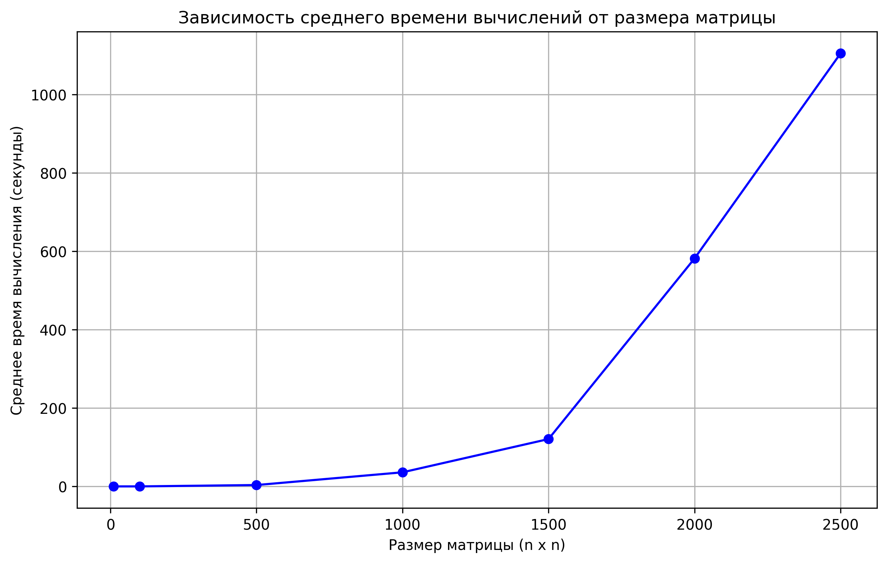
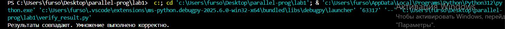

# ЛАБОРАТОРНАЯ РАБОТА 1
## <u>ЗАДАНИЕ</u>
Написать программу на языке C/C++ для перемножения двух матриц. 
Исходные данные: файл(ы) содержащие значения исходных матриц.
Выходные данные: файл со значениями результирующей матрицы, время выполнения, объем задачи.
Обязательна автоматизированная верификация результатов вычислений с помощью сторонних библиотек или стороннего ПО (например на Matlab/Python).

Файл с кодом: main.cpp
Файлы содержащие значения исходных матриц: matrixA.txt, matrixB.txt
Файл с результатом перемножения: resultMatrix.txt
Автоматизированная верификация результатов вычислений: verify_result.py
Построение графика: grafik.py
График "Зависимость размера матрицы от времени выполнения": result.png

Программа реализует умножение квадратных матриц разного размера, измеряя время выполнения операции. Сначала генерируются две случайные матрицы с целочисленными значениями от 0 до 99, которые сохраняются в файлы matrixA.txt и matrixB.txt. Затем выполняется 10 итераций умножения матриц, где каждая итерация включает чтение матриц из файлов, выполнение умножения с замером времени и сохранение результата в файл resultMatrix.txt. После всех итераций вычисляется среднее время выполнения операции. Программа выводит время каждой итерации, среднее время умножения и общее количество операций.

## <u>Получены следующие средние времена выполнения (секунды):</u>
| Размер матрицы | Среднее время   |
|----------------|-----------------|
| 10x10          | 4.192e-05       |
| 100x100        | 0.0262727       |
| 500x500        | 3.49101         |
| 1000x1000      | 35.9732         |
| 1500x1500      | 120.822         |
| 2000x2000      | 581.747         |
| 2500x2500      | 1104.99         |

## <u>ВЫВОД:</u>
* Время выполнения растёт нелинейно с увеличением размера матрицы, приблизительно по кубической зависимости O(n³)
* Результаты, полученные в программе на C++, совпадают с результатами, полученными через NumPy
