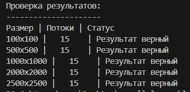

# ЛАБОРАТОРНАЯ РАБОТА 1
## <u>ЗАДАНИЕ</u>
Модифицировать программу из л/р №1 для параллельной работы по технологии OpenMP.

Файл с кодом: main2.cpp
Файлы содержащие значения исходных матриц: matrixA.txt, matrixB.txt
Файл с результатом перемножения: result.txt
Автоматизированная верификация результатов вычислений: verify.py
График "Зависимость размера матрицы от времени выполнения": image-1.png

Программа проводит сравнительный анализ производительности параллельного умножения квадратных матриц с использованием OpenMP. Она автоматически генерирует набор тестовых матриц размером от 100×100 до 2500×2500 элементов, заполненных случайными целыми числами от 0 до 99. Для каждого размера матрицы программа выполняет 10 итераций умножения с разным количеством потоков, замеряя среднее время.

## Результаты тестирования умножения матриц

- **Размеры матриц**: 100×100, 500×500, 1000×1000, 2000×2000, 2500×2500
- **Количество потоков**: 2, 5, 10, 15
- **Количество запусков**: 10 для каждого теста

### 2 потока
| Размер матрицы | Время (сек) |
|----------------|------------|
| 100×100        | 0.018135   |
| 500×500        | 1.499691   |
| 1000×1000      | 17.113052  |
| 2000×2000      | 263.731367 |
| 2500×2500      | 460.734966 |

### 5 потоков
| Размер матрицы | Время (сек) |
|----------------|------------|
| 100×100        | 0.030692   |
| 500×500        | 0.922284   |
| 1000×1000      | 10.413349  |
| 2000×2000      | 149.053923 |
| 2500×2500      | 257.736539 |

### 10 потоков
| Размер матрицы | Время (сек) |
|----------------|------------|
| 100×100        | 0.015416   |
| 500×500        | 0.926239   |
| 1000×1000      | 10.36157   |
| 2000×2000      | 147.579073 |
| 2500×2500      | 259.152179 |

### 15 потоков
| Размер матрицы | Время (сек) |
|----------------|------------|
| 100×100        | 0.015467   |
| 500×500        | 0.891345   |
| 1000×1000      | 10.442163  |
| 2000×2000      | 147.519914 |
| 2500×2500      | 257.242244 |

## Вывод
**Параллелизация эффективна**, но:
- Оптимальный диапазон: **5-10 потоков**
- Использование **>10 потоков не улучшает производительность**
- Для **очень больших матриц** (>2000×2000) дополнительные потоки практически не дают преимуществ

**Итог:** параллельная версия показывает стабильное ускорение в 3-4 раза по сравнению с однопоточной реализацией.
Результаты, полученные в программе на C++, совпадают с результатами, полученными через NumPy.

