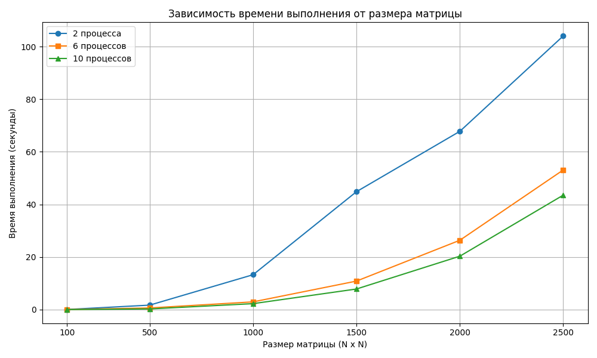
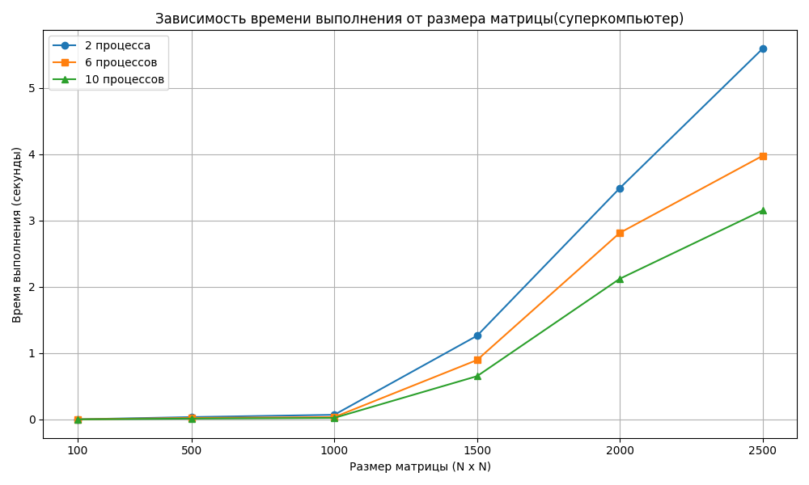
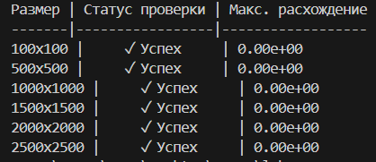

# ЛАБОРАТОРНАЯ РАБОТА 3
## <u>ЗАДАНИЕ</u>
Модифицировать программу из л/р №1 для параллельной работы по технологии MPI.

## Описание структуры проекта

**Исходные файлы:**
- `main.cpp` - основной файл с программой параллельного умножения матриц

**Рабочие директории:**
- `out\build\x64-Debug\files_txt\` - папка с входными/выходными файлами

**Файлы с матрицами:**
- Исходные матрицы:
  - `mat1_{size}.txt` - первая матрица (размер: {size}x{size})
  - `mat2_{size}.txt` - вторая матрица (размер: {size}x{size})
  
- Результаты вычислений:
  - `res_{size}.txt` - результат умножения матриц

**Скрипт проверки:**
- `verify.py` - скрипт автоматической верификации результатов

Программа реализует параллельное умножение матриц с помощью MPI. Главный процесс генерирует пары матриц разных размеров и сохраняет их в папку. Все процессы совместно вычисляют произведение матриц, распределяя строки между собой. Результаты собираются на главном процессе, который записывает их в файлы и замеряет время выполнения. В конце сохраняется отчет с временами вычислений для каждого размера матрицы.

## Результаты тестирования умножения матриц на обычном компьютере

- **Размеры матриц**: 100×100, 500×500, 1000×1000, 1500×1500, 2000×2000, 2500×2500
- **Количество процессов**: 2, 6, 10

| Размер матрицы | 2 процесса | 6 процессов | 10 процессов |
|----------------|------------|-------------|--------------|
| 100×100        | 0.028 s    | 0.0055 s    | 0.0019 s     |
| 500×500        | 1.684 s    | 0.603 s     | 0.241 s      |
| 1000×1000      | 13.249 s   | 2.923 s     | 2.245 s      |
| 1500×1500      | 44.832 s   | 10.826 s    | 7.817 s      |
| 2000×2000      | 67.791 s   | 26.356 s    | 20.296 s     |
| 2500×2500      | 104.071 s  | 53.092 s    | 43.517 s     |

## Результаты тестирования умножения матриц на суперкомпьютере Сергей Королев

| Размер матрицы | 2 процесса | 6 процессов | 10 процессов |
|----------------|------------|-------------|--------------|
| 100×100        | 0.00063 s  | 0.00031 s   | 0.00022 s    |
| 500×500        | 0.0349 s   | 0.0217 s    | 0.0118 s     |
| 1000×1000      | 0.0689 s   | 0.0341 s    | 0.0224 s     |
| 1500×1500      | 1.2614 s   | 0.8951 s    | 0.6516 s     |
| 2000×2000      | 3.4886 s   | 2.8138 s    | 2.1214 s     |
| 2500×2500      | 5.5912 s   | 3.9758 s    | 3.1519 s     |

## Вывод
Из результатов видно, что:
- Чем больше размер матрицы, тем дольше идёт умножение, если использовать только 2 процесса. При увеличении числа процессов — время работы сильно сокращается.
- Суперкомпьютер "Сергей Королёв" работает значительно быстрее, особенно при работе с большими матрицами. Это связано с тем, что у него мощнее процессоры и лучше организована работа между ними.
- На небольших задачах разница между обычным компьютером и суперкомпьютером не очень большая. Но при больших матрицах суперкомпьютер показывает огромное ускорение.

**В целом, чем больше задача и мощнее техника — тем выше выгода от параллельной обработки данных. Это особенно полезно при работе с большими объёмами информации.** 

## Результаты, полученные в программе на C++, совпадают с результатами, полученными через NumPy.
